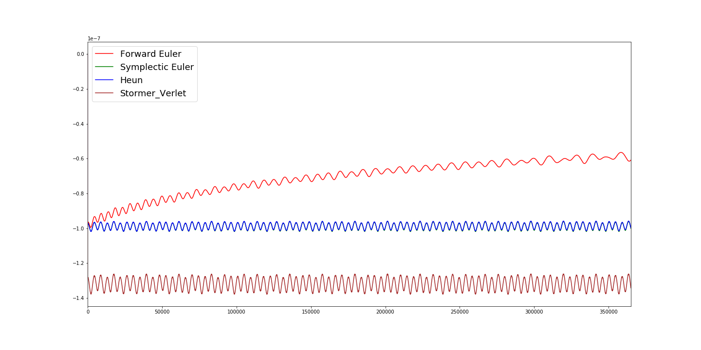
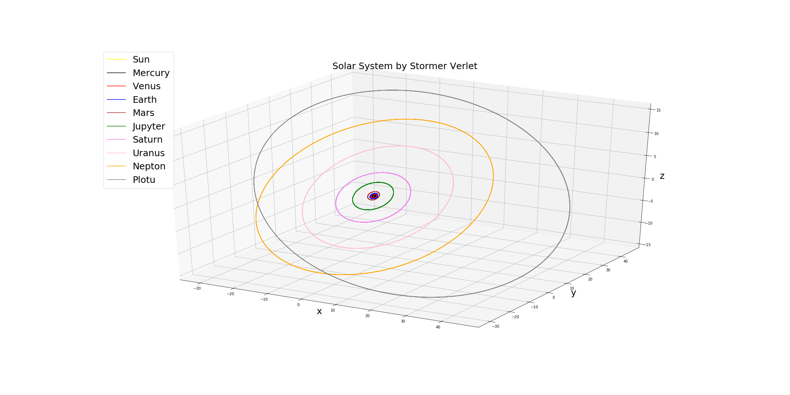

#                             Geometrical Numerical Integration
 *******************************************************************************************

## Problem 1: Geometric itegration of solar system.

We assume that the solar system is a ten body problem.

$\bullet$ We numerically integrate the solar system using the symplectic Euler method and the Stormer-Verlet method. 

$\bullet$ The final integration time should be t = 1000 years.

$\bullet$ Repeat the above experiment using the forward Euler, backward Euler and Heun's method.

$\bullet$ Plot the time series of the absolute error of the total energy for all the above methods.

### Method:
Write the Hamiltonian for planets and sun in the solar system and, compute all the orbits. Also, The energy and
momentum of each planet should be calculated. The problem is solved with different numeric methods to compare
their accuracy. These methods are:

$\bullet$ Forward Euler

$\bullet$ Backward Euler

$\bullet$ Symplectic Euler

$\bullet$ Heun

$\bullet$ Stormer-Verlet

Outputs will be stored in a file including positions and momentums.

         xi    yi    zi    pxi   pyi   pzi
Sun       
Mercury        
Venus          
Earth          
Mars      
Jupyter   
Saturn    
Uranus    
Nepton    
Pluto    

 " i " is initial state which is necessary to start solving the equations.

 #### Analyze stability:

 Time series of the absolute error of the total energy for all the above methods:

 

 Orbital positions calculation (the most accurate: Stormer-Verlet):

 

************************************************************************************

## Problem 2: Geometric integration of a point vortex system.

### Method: 

$\bullet$ Numerically integrate the point vortex equations using the two-stage symplectic Gauss
Legendre Runge-Kutta method and the four-stage explicit Runge-Kutta method for a system of three 
point vortices of equal strength. 

$\bullet$ Determine the initial positions (1; 0), (1; 0) and (0; 1). Record the relative
errors in the conserved quantities and compare the results. Choose t = 1000 as  final integration time.

$\bullet$ Integrate the system of point vortex equations on the plane, according to the
hamilotonian Dynamics.

$\bullet$ Numerically integrate the point vortex equations using the two-stage symplectic
Runge Kutta method and the four-stage explicit Runge Kutta method.

$\bullet$ The point vortex equations can be used as a simpli ed model for the stability of the
polar vortex.

